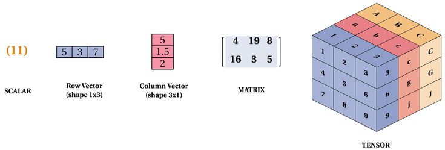

# Mathematics for Machine Learning and Data Science Specialization - DeepLearning.AI

Este repositorio contiene apuntes, prácticas y material de los cursos de la Especializacion en Matemáticas para Data Science & Machine Learning dictado por Deep Learning AI. 
  1. Linear Algebra for Machine Learning and Data Science
  2. Calculus for Machine Learning and Data Science
  3. Probability & Statistics for Machine Learning & Data Science



## Contenidos

### 1. Álgebra Lineal
- **Vectores y Matrices**: Introducción a los conceptos de vectores y matrices y cómo trabajar con ellos.
- **Operaciones con Matrices**: Multiplicación, inversa y determinante de matrices.
- **Aplicaciones en Machine Learning**: Uso de álgebra lineal para calcular el PageRank de una pequeña simulación de internet.

### 2. Cálculo Multivariado
- **Introducción al Cálculo**: Conceptos básicos de cálculo y optimización.
- **Fitting Functions**: Ajuste de funciones para obtener buenos ajustes a los datos.
- **Aplicaciones en Machine Learning**: Entrenamiento de redes neuronales y regresión no lineal de mínimos cuadrados.

### 3. Reducción de Dimensionalidad con Análisis de Componentes Principales (PCA)
- **Compresión de Datos**: Uso de matemáticas para comprimir datos de alta dimensionalidad.
- **PCA**: Aplicación del análisis de componentes principales para determinar las características del conjunto de datos MNIST.
- **Aplicaciones en Machine Learning**: Featurización de datos para procesos de ML.

## Skills
- **Machine Learning**
- **Cálculo**
- **Álgebra Lineal**
- **Estadísticas y Probabilidad**
- **Algoritmos de Machine Learning**
- **Redes Neuronales Artificiales**
- **Análisis de Regresión**

## Requisitos
- Python 3.x
- Numpy, Pandas, Scikit-learn
- TensorFlow / PyTorch

## Instalación
```bash
# Clonar el repositorio
git clone https://github.com/gdiazistea/maths_for_ml_deeplearning_ai.git
cd repo-maths_for_machinelearning

# Crear un entorno virtual e instalar dependencias
python -m venv venv
source venv/bin/activate  # En Windows: venv\Scripts\activate
pip install -r requirements.txt
```

## Uso
Los notebooks y scripts explicativos están organizados en carpetas según los módulos. 
Revisa `nbs/` para explorar ejemplos y ejercicios.
